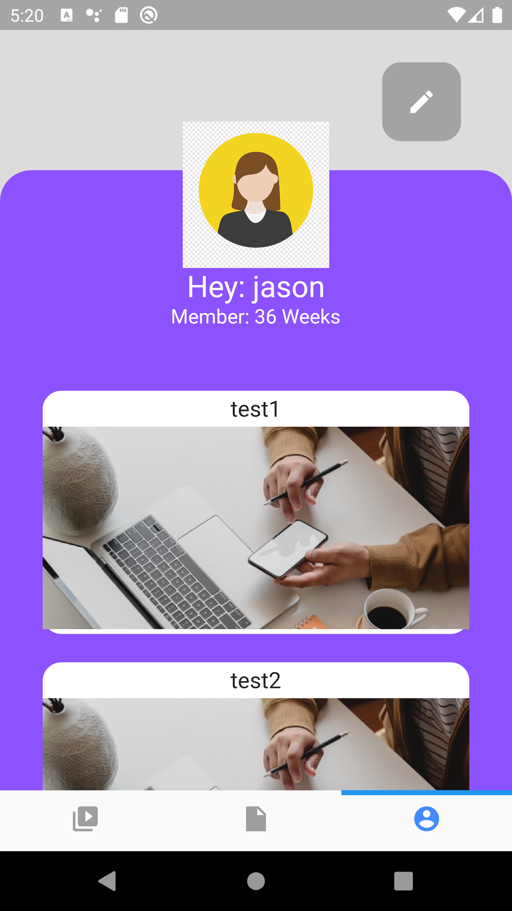

# Firebase Clean Login

Example project made to test out the power of Firebase

 

## This project utilises:
* Firebase Storage
* Firebase Authentication
* Cloud FireStore

 

## Project gif

  

 

## Screenshots

  
  &nbsp;&nbsp;
  
  &nbsp;&nbsp;
  
  &nbsp;&nbsp;
  
  &nbsp;&nbsp;
  
  &nbsp;&nbsp;
  
  &nbsp;&nbsp;
  
  &nbsp;&nbsp;
  

